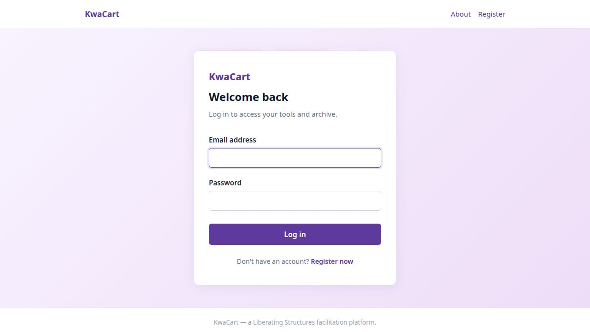
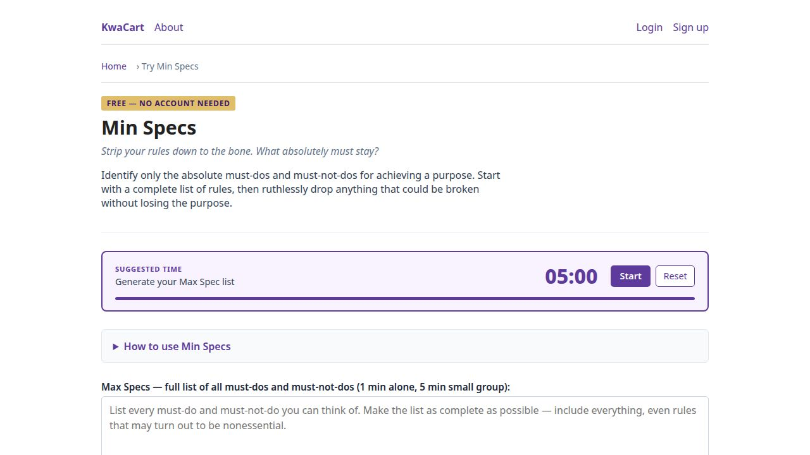
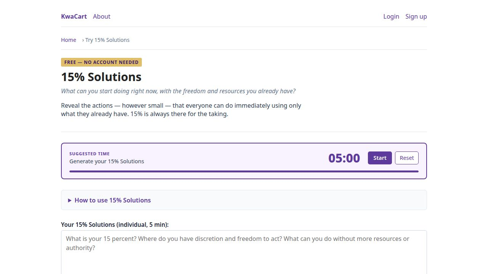
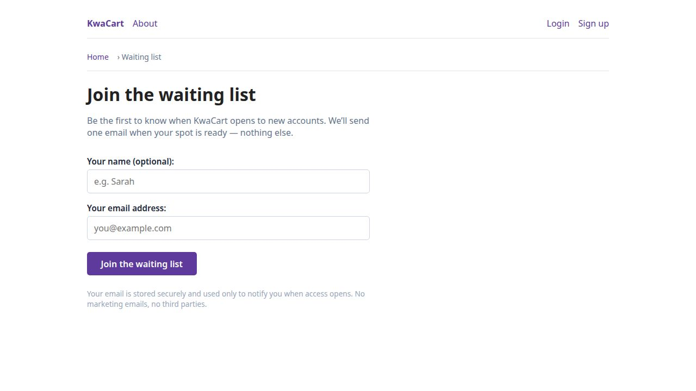
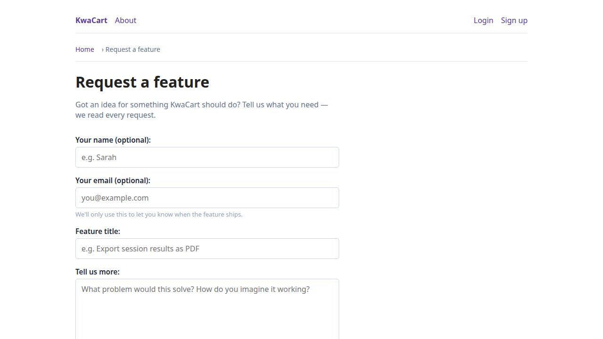
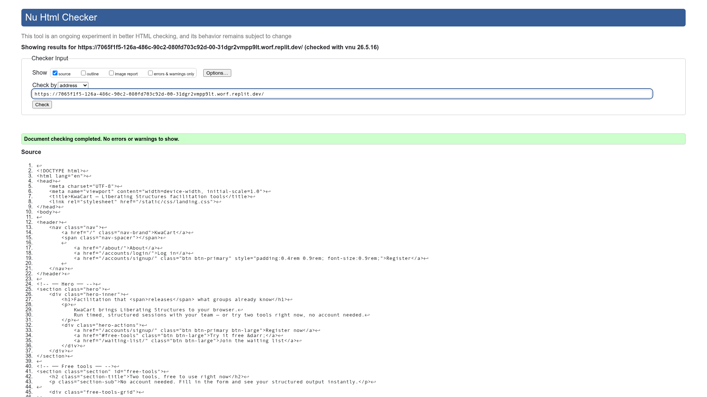
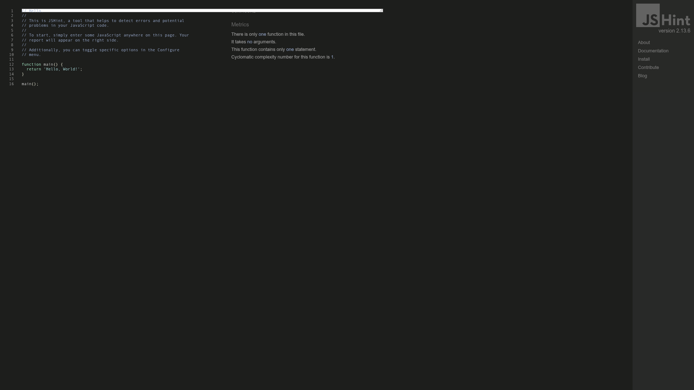

# KwaCart

**Milestone Project 3 — Level 5 Diploma in Web Software Engineering**

KwaCart is a Django-based facilitation platform built around **Liberating Structures** — 23 participatory methods that help groups do their best thinking together. It gives facilitators a bank of ready-made tools — warm-ups, reflection exercises, peer consultation formats, and more — that participants can complete individually or together in a live collaborative session. Responses are archived and exportable as Markdown and RTF documents.

---

## Table of Contents

1. [Purpose](#purpose)
2. [Tech Stack](#tech-stack)
3. [User Stories](#user-stories)
4. [Site Wireframe](#site-wireframe)
5. [Project Structure](#project-structure)
6. [Public Pages (no account required)](#public-pages-no-account-required)
7. [Key Features](#key-features)
8. [Facilitation Tools](#facilitation-tools)
9. [Collaborative Sessions](#collaborative-sessions)
10. [Archive & Exports](#archive--exports)
11. [Data Models](#data-models)
12. [User Accounts](#user-accounts)
13. [Running Locally](#running-locally)
14. [Deployment](#deployment)
15. [Security](#security)
16. [Admin](#admin)
17. [Adding a New Tool](#adding-a-new-tool)
18. [Validation](#validation)
19. [Credits](#credits)

---

## Purpose

Organisations often struggle to create the conditions for honest, constructive dialogue. KwaCart provides a lightweight facilitation toolkit — grounded in Liberating Structures methodology — that any team can use to surface challenges, share hopes, and warm up to productive conversation. The platform removes the friction of paper-based activities by letting every participant log in, work through a structured prompt, and instantly see a combined result when the facilitator closes the session.

---

## Tech Stack

| Layer | Technology |
|---|---|
| Language | Python 3.12 |
| Framework | Django 6.0.4 |
| Database (dev) | SQLite (`db.sqlite3`) |
| Static files | WhiteNoise 6.6 |
| Production server | Gunicorn 25.x |
| Hosting | Replit (development & production) |

---

## User Stories

| # | As a… | I want to… | So that… |
|---|---|---|---|
| 1 | Visitor | browse the landing page without logging in | I can understand what the platform offers before committing to an account |
| 2 | Visitor | use a free tool (Min Specs or 15% Solutions) without an account | I can experience the platform's value before signing up |
| 3 | Visitor | join the waiting list with my email | I am notified when the platform opens more widely |
| 4 | Visitor | submit a feature request | I can influence the product roadmap |
| 5 | New user | register for an account with my email and a password | I can save my work and participate in sessions |
| 6 | Returning user | log in to my account | I can access my archive and join live sessions |
| 7 | Logged-in user | browse the full tool catalog | I can choose the right facilitation tool for my situation |
| 8 | Logged-in user | draft a tool response at my own pace, with autosave | I can refine my thinking without losing progress |
| 9 | Logged-in user | submit a solo draft and receive a downloadable Markdown and RTF export | I have a portable record of my thinking |
| 10 | Facilitator (host) | start a collaborative session for any tool | I can run a real-time group activity |
| 11 | Facilitator | share a session link with signed-in participants | Colleagues who already have accounts can join immediately |
| 12 | Facilitator | display a guest QR code that participants scan to join without an account | I can include participants who haven't registered, such as external guests or workshop attendees |
| 13 | Guest participant | scan a QR code, enter only my name, and fill in a session form | I can contribute to a live session without creating an account |
| 14 | Facilitator | see participant names (including guests) update in real time as people join | I can gauge readiness before starting |
| 15 | Facilitator | start, pause, and reset a countdown timer that all participants see in sync | I can time-box each phase of the activity |
| 16 | Facilitator | close the session when everyone has responded | All contributions are locked and a combined export is generated automatically |
| 17 | Participant (signed-in or guest) | be redirected automatically when the host closes the session | I see the combined results without needing to refresh |
| 18 | Logged-in user | view my archive of solo submissions and sessions | I can revisit and reflect on past work |
| 19 | Logged-in user | download Markdown and RTF exports for any archived record | I can share outputs or store them outside the platform |
| 20 | Staff user | view the waiting-list table in the archive dashboard | I can manage the rollout and follow up with prospective users |
| 21 | CEO | run structured dialogue sessions across teams and levels of my organisation using a shared facilitation tool | I can break down communication barriers, surface what people actually think, and replace top-down messaging with genuine two-way conversation |
| 22 | Middle manager | deploy a live session tool so that everyone involved in a stalled project can contribute their perspective in real time and see each other's responses immediately when the session closes | the process feels transparent and trustworthy, and the team can move forward together based on evidence rather than assumption |
| 23 | Youth worker | guide a group of young people through a series of facilitation tools, saving every session's responses to a growing archive | the group builds a real record of their collective thinking while also developing practical skills in scribing, facilitation, and working with structured data |

---

## Site Wireframe

### Landing Page
The public homepage — introduces the platform, links to free tools, registration, and the waiting list.


---

### About Page
Explains Liberating Structures, the 23 tools, and the project background.


---

### Register
New account creation — email address and password. Redirects to login on success.


---

### Log In
Email-based login. Redirects authenticated users directly to the tool catalog.



---

### Free Tool — Min Specs
Try Min Specs without an account. Includes a 5-minute countdown timer, structured form, and instant output.



---

### Free Tool — 15% Solutions
Try 15% Solutions without an account. Same timer and structured output experience.



---

### Waiting List Signup
Visitors can register their interest before accounts open publicly.



---

### Feature Request
Visitors and users can submit ideas for new tools or platform improvements.



---

### Guest Join
Participants who scan the QR code land here. They enter only their name — no account needed — and go straight to the session form.


---

### Page Access Map

| Colour | Meaning |
|---|---|
| Public (no login) | Landing, About, Free Tools, Waiting List, Feature Request, Login, Register |
| Login required | Tool Catalog, Draft Editor, Session pages, Archive Dashboard, Archive Detail, Downloads |
| Staff / Admin only | Waiting list table in dashboard, Django Admin (`/admin/`) |

---

## Project Structure

```
KwaCart/
├── config/
│   ├── settings/
│   │   ├── base.py          Shared settings
│   │   ├── local.py         Dev overrides (DEBUG=True, ALLOWED_HOSTS from REPLIT_DOMAINS)
│   │   └── production.py    Production settings (Gunicorn, WhiteNoise, SECURE_PROXY_SSL_HEADER)
│   ├── urls.py              Root URL config — home, about, waiting-list, feature-request, accounts, tools, archive
│   └── wsgi.py
│
├── accounts/                Email-based auth
│   ├── models.py            Custom User + UserManager (validate_password enforced)
│   ├── forms.py             Registration / login forms
│   └── utils.py             log_action() helper (writes to AuditLog)
│
├── tools/                   Facilitation tool engine
│   ├── registry.py          TOOL_CATALOG — single source of truth for all 23 tools
│   ├── implementations.py   BaseTool subclasses (validate + process)
│   ├── forms.py             Django Form classes for each tool
│   ├── views.py             Solo draft + collaborative session + free try-it flows
│   ├── urls.py              URL patterns
│   └── utils.py             get_tool_metadata() + SHA-256 canvas file handling
│
├── archive/                 Sessions, submissions, waiting list, feature requests
│   ├── models.py            ToolSession, ToolInstance, AuditLog, WaitingListEntry, FeatureRequest
│   ├── admin.py             Admin registrations for all archive models
│   ├── views.py             Archive dashboard + detail + waiting list signup + feature request
│   ├── views_downloads.py   Secure file download (solo + session exports)
│   ├── urls.py
│   ├── urls_waitinglist.py  Public waiting-list routes
│   └── urls_feature_request.py  Public feature-request routes
│
├── exporters/
│   ├── pipeline.py          run_export_pipeline() / run_session_export_pipeline()
│   ├── md_gen.py            Markdown generation (solo + combined)
│   └── rtf_gen.py           RTF generation (solo + combined)
│
├── templates/
│   ├── base.html            Site chrome (nav, messages, .sr-only utility)
│   ├── landing.html         Public homepage — no login required
│   ├── about.html           About page
│   ├── accounts/            Login, registration templates
│   ├── archive/
│   │   ├── dashboard.html              Personal archive + waiting-list section (staff only)
│   │   ├── detail.html
│   │   ├── waiting_list_signup.html    Public signup
│   │   └── feature_request.html        Public feature request form
│   └── tools/
│       ├── catalog.html          Tool bank
│       ├── tool_try.html         Free try-it page (no login, countdown timer)
│       ├── draft_editor.html     Solo drafting interface
│       ├── session_open.html     Live collaborative session (QR code share)
│       ├── session_closed.html   Combined results + download links
│       ├── info_box.html         What / How / Why / agreements panel
│       ├── _timer.html           Countdown timer (server-sync, aria-live, offline detection)
│       └── _drawing_canvas.html  Drawing canvas with accessibility announcements
│
├── media/drawings/          Canvas PNG files (SHA-256 content-based filenames)
├── static/
├── manage.py
└── requirements.txt
```

---

## Public Pages (no account required)

| URL | Description |
|---|---|
| `/` | Landing page — introduces the platform, links to free tools and waiting list |
| `/about/` | About page — explains Liberating Structures, the 23 tools, and the project |
| `/tools/min-specs/try/` | Free try-it page for Min Specs |
| `/tools/15-percent-solutions/try/` | Free try-it page for 15% Solutions |
| `/waiting-list/` | Waiting-list signup (email + optional name) |
| `/request-a-feature/` | Feature request form (name, email, title, description) |
| `/accounts/login/` | Log in |

### Free try-it pages
Both free tools include the full form and result output, a **5-minute countdown timer** with Start / Pause / Reset controls, a progress bar, and screen-reader-friendly milestone announcements. A "Join the waiting list" nudge is shown instead of a "Create account" call-to-action.

### Waiting list
Visitors can sign up at `/waiting-list/`. Duplicate email addresses are handled gracefully. Staff users see the full waiting-list table in the archive dashboard.

### Feature requests
Visitors and users can submit a feature idea at `/request-a-feature/`. Submissions are stored in the `FeatureRequest` model and are visible to staff only via the Django admin. The form collects name, email, a short title, and a description.

---

## Key Features

### Colour palette
The interface uses a 6-colour palette:

| Colour | Hex | Role |
|---|---|---|
| Purple | `#5D3A9B` | Primary brand, buttons, links |
| Teal | `#40B0A6` | Success states, result borders, open-session indicators |
| Gold | `#E1BE6A` | "Free" badges, count labels, CTA band highlight button |
| Orange | `#E66100` | Step numbers, running-timer button |
| Yellow | `#FEFE62` | "Already on list" duplicate-notice border |
| Pink | `#D35FB7` | Accent use |

### Solo tool use
Any logged-in user can pick a tool from the catalog, draft at their own pace (autosave on every keystroke), and submit when ready. Submission processes the response and stores downloadable Markdown and RTF files.

### Collaborative sessions
A facilitator creates a **session** for any tool. Participants join via a shared URL or **QR code** displayed on the session page. Every four seconds, the page polls for participant list updates, timer state, and session-closed redirects. When the facilitator closes the session, all responses are processed and a combined export is generated.

#### Guest QR code access (no account needed)
The session page shows two share options:

- **Signed-in link** — for participants who already have an account.
- **Guest QR code** — a separate link (and scannable QR code) that lets anyone join without creating an account. Scanning the code takes the participant to a name-entry page; after entering their name they go straight to the form. The host sees all participants — including guests — listed by name in real time.

Guest responses are saved alongside signed-in responses and appear in the combined results when the session closes. Guests see a prompt to create an account at the end if they'd like to keep a personal archive in future.

### Drawing canvas
Tools with `show_canvas: True` in the registry include a freehand drawing canvas. Drawings are saved as PNG files in `media/drawings/` using SHA-256 content-based filenames. The file path (not the data URL) is stored in `payload_input`. The canvas includes keyboard and screen-reader accessibility support with ARIA live announcements for every toolbar action.

### Archive dashboard
`/archive/dashboard/` shows solo submissions, sessions the user hosts or has joined (with role and status), and a waiting-list table (staff users only).

### Timer widget
Tools can opt in to a countdown timer. The timer:

- MM:SS display, turns amber at ≤ 10 s, red at zero.
- Start / Pause / Reset controls with a phase progress bar.
- **Server sync** — all participants see the same remaining time via the poll endpoint.
- **Late-join** — screen readers hear an approximate time-remaining message on first sync.
- **Milestone announcements** at 5 min, 2 min, 1 min, 30 s, and 10 s.
- **Phase-transition announcements** — each phase change fires exactly one ARIA live announcement.
- **Pause badge** — visible "Paused" indicator; host-only amber reminder if paused for over 5 minutes (configurable threshold via `pause_reminder_threshold_sec`).
- **Long-pause teardown** — the amber reminder clears immediately when the host resumes.
- **Reconnection toast** — banner appears after a connectivity outage clears.
- **Offline detection** — stale badge shown immediately on `window.offline` event, not just on poll failure.
- **Reset announcement fix** — reset from paused announces "Timer reset", not "Timer resumed".

### What / How / Why info panel
Every tool page includes a structured instruction panel with **What**, **How**, **Why**, and optional **Agreements**. A **Load example data** button pre-fills the form.

### Tool catalog
Each tool card shows its title, a short tagline, and **Start solo** / **Start session** buttons.

---

## Facilitation Tools

23 tools are currently registered across two categories.

### Low-Risk Warm-ups

| Tool | Tagline |
|---|---|
| I am and I like | A quick energiser — go around the circle, share your name and something you love. |

### Facilitation

| Tool | Tagline |
|---|---|
| 1-2-4-All | Turn any question into group insight — alone, then pairs, then fours, then everyone. |
| 15% Solutions | What can you start doing right now, with the freedom and resources you already have? |
| 25/10 Crowd Sourcing | Surface your group's boldest ideas in 30 minutes with cards and a countdown from 25. |
| Appreciative Interviews | Uncover what's already working by sharing stories of peak success. |
| Conversation Café | Calm group dialogue on a hard question — a talking object and four structured rounds. |
| Discovery & Action Dialogue | Seven questions that surface hidden solutions already working in your group. |
| Drawing Together | A silent, simultaneous visual exercise using five universal shapes. |
| Five Structural Elements | Get into pairs, share challenges and expectations, build new connections fast. |
| Helping Heuristics | Practise four ways of helping in 15 minutes and discover your default pattern. |
| Idea Generation | A minute of individual reflection, then share with the group. |
| Improv Prototyping | Act out the problem, spot what works, and rebuild a better version on the spot. |
| Impromptu Networking | Meet three people, share your challenge, walk away with fresh ideas. |
| Min Specs | Strip your rules down to the bone. What absolutely must stay? |
| Nine Whys | Ask "why?" nine times and find out what actually drives you. |
| Shift & Share | Ditch the long presentations. Rotate through rapid-fire innovation stations instead. |
| TRIZ | List everything that would guarantee failure — then stop doing those things. |
| Troika Consulting | Three people, three turns, back turned. Straight-talking peer advice in 30 minutes. |
| User Experience Fishbowl | Insiders share the unfiltered story. The room listens, then asks. |
| What, So What, Now What? | Debrief any shared experience in three stages — facts first, then meaning, then action. |
| Wicked Questions | Name the contradictions your group is navigating — and make them visible. |
| Wise Crowds | 15 minutes of focused peer advice on a real challenge, with the client's back turned. |
| Wise Crowds (Large Group) | Scale peer consultation to a full room — one client, primary team, satellite groups. |

---

## Collaborative Sessions

| Step | Who | What happens |
|---|---|---|
| Create | Host | Clicks **Start session** on a tool card → session created, shareable URL and QR code generated |
| Share | Host | Copies the URL or displays the QR code for participants to scan |
| Join | Participant | Opens URL, logs in if not already, sees the form |
| Respond | Everyone | Fills in the form, clicks **Save my response** (editable until session closes) |
| Monitor | Host | Sees participant list update live; a green tick appears next to anyone who has saved |
| Close | Host only | Clicks **Close session and reveal results** → all responses locked, exports generated |
| View | Everyone | Combined results page shows all contributions; host and participants can download MD/RTF |

**Access control:**

- Only logged-in users can join.
- Only the host can close a session.
- Downloads are restricted to the host and participants; anyone else gets a 404.
- The status polling endpoint returns 403 to non-participants.

---

## Archive & Exports

### Solo submissions
On submit, the pipeline generates two files per record:

- `archives/md/<date>_<slug>_<id>.md`
- `archives/rtf/<date>_<slug>_<id>.rtf`

Files are downloadable from the archive detail page.

### Combined session exports
When a session is closed, the pipeline generates two combined files:

- `archives/md/<date>_<slug>_session_<uuid>.md`
- `archives/rtf/<date>_<slug>_session_<uuid>.rtf`

Each file lists every participant's processed output in sequence. Download links appear at the top of the closed-session page.

---

## Data Models

### `ToolSession`
| Field | Description |
|---|---|
| `id` | UUID primary key (used in shareable URLs) |
| `host` | FK → User — the facilitator who created the session |
| `tool_slug` | Which tool this session runs |
| `tool_version` | Version string at time of creation |
| `status` | `open` or `closed` |
| `created_at` / `closed_at` | Timestamps |
| `timer_started_at` | DateTimeField — when the timer was last started |
| `timer_paused_at` | DateTimeField — when the timer was paused (null if running or never paused) |
| `timer_elapsed_before_pause` | FloatField — seconds elapsed before the current pause |
| `pause_reminder_threshold_sec` | IntegerField — minutes of inactivity before the host sees a pause reminder (default 5 min) |
| `md_file` / `rtf_file` | Combined export files (populated on close) |

### `ToolInstance`
One per user per session (or one per solo submission).

| Field | Description |
|---|---|
| `user` | FK → User |
| `session` | FK → ToolSession (null for solo) |
| `tool_slug` / `tool_version` | Tool identity |
| `status` | `draft` → `archived` on submit / session close |
| `payload_input` | Raw form data (JSON); drawing tools store canvas file path, not data URL |
| `payload_output` | Processed result (JSON) |
| `md_file` / `rtf_file` | Per-instance export files (solo only) |
| `submitted_at` | Set when status transitions to `archived` |

A `UniqueConstraint` on `(session, user)` prevents a participant from having more than one response per session.

### `WaitingListEntry`
| Field | Description |
|---|---|
| `email` | Unique email address |
| `name` | Optional display name |
| `signed_up_at` | Auto timestamp |

### `FeatureRequest`
| Field | Description |
|---|---|
| `name` | Submitter's name |
| `email` | Submitter's email |
| `title` | Short feature title (max 300 chars) |
| `description` | Full description (free text) |
| `submitted_at` | Auto timestamp |

Visible to staff only via Django admin. No user account required to submit.

### `AuditLog`
Records login events, tool submissions, and file downloads with IP address and timestamp.

---

## User Accounts

Authentication is email-based (no username). The custom `User` model uses `email` as `USERNAME_FIELD`. Django's built-in password validators are enforced at the model layer via `validate_password()`.

| URL | Purpose |
|---|---|
| `/accounts/login/` | Log in |
| `/accounts/register/` | Create an account |
| `/accounts/logout/` | Log out (redirects to login) |
| `/archive/dashboard/` | Personal archive + session list |
| `/tools/` | Tool catalog |

---

## Running Locally

```bash
# 1. Install dependencies
pip install -r requirements.txt

# 2. Apply migrations
python manage.py migrate

# 3. Create a superuser
python manage.py createsuperuser

# 4. Start the development server
python manage.py runserver 0.0.0.0:5000
```

The app will be available at `http://localhost:5000`.

**Environment:** The project reads settings from `config.settings.local` by default (`DJANGO_SETTINGS_MODULE` is set in `manage.py`). No `.env` file is required for local development — `ALLOWED_HOSTS` falls back to `localhost` / `127.0.0.1` when the `REPLIT_DOMAINS` environment variable is absent.

---

## Deployment

The project is configured for Replit Autoscale deployment using Gunicorn:

```
gunicorn --bind=0.0.0.0:5000 --reuse-port config.wsgi:application
```

`python manage.py migrate` and `python manage.py collectstatic` run as build steps before the server starts.

Static files are served by WhiteNoise (configured in `base.py` middleware).

Production settings (`config.settings.production`) are activated via `DJANGO_SETTINGS_MODULE`. SSL termination is handled by the Replit proxy; `SECURE_SSL_REDIRECT` is disabled but `SECURE_PROXY_SSL_HEADER` is set correctly.

---

## Security

| Measure | Detail |
|---|---|
| `ALLOWED_HOSTS` | Derived from `REPLIT_DOMAINS` env var; no wildcard in production |
| `CSRF_TRUSTED_ORIGINS` | Exact domain list from `REPLIT_DOMAINS` |
| Password validation | `validate_password()` called before `set_password()` in `UserManager` |
| Canvas file hashing | SHA-256 content-addressable PNG filenames in `media/drawings/` |
| Gunicorn | Pinned to ≥ 23.0.0 (addresses HTTP request-smuggling CVEs in 21.x) |
| Download access control | Session exports restricted to host and participants |
| Poll endpoint | Returns 403 to non-participants |
| Feature requests | Submissions stored server-side; not exposed publicly |

---

## Admin

The Django admin at `/admin/` provides full CRUD for:

- `ToolSession` — view and manage collaborative sessions.
- `ToolInstance` — view individual submissions.
- `AuditLog` — read-only activity trail.
- `WaitingListEntry` — view and export waiting-list signups.
- `FeatureRequest` — view submitted feature ideas (staff only).
- `User` — manage accounts and permissions.

Default superuser credentials (development only):
- Email: `admin@example.com`
- Password: `admin12345`

---

## Adding a New Tool

1. **Create a form** in `tools/forms.py` — one `forms.Form` subclass with the fields you need.

2. **Create an implementation** in `tools/implementations.py` — subclass `BaseTool`, implement `validate()` and `process()`. `process()` must return a dict.

3. **Register the tool** in `tools/registry.py` — add an entry to `TOOL_CATALOG`:

```python
'my-tool-slug': {
    'class': 'tools.implementations.MyTool',
    'form_class': 'tools.forms.MyToolForm',
    'title': 'My Tool',
    'tagline': 'One punchy sentence shown on the catalog card.',
    'category': 'Facilitation',
    'what': 'Physical setup description.',
    'how': 'Step-by-step instructions.',
    'why': 'Facilitation rationale.',
    'agreements': ['Ground rule one.'],   # optional
    'example_input': {'field': 'value'},  # optional — powers Load example data
    'display_fields': ['field', 'word_count'],
    'timer_seconds': 300,                 # optional — session countdown timer
    'try_timer_seconds': 60,              # optional — solo try-it page timer
    'try_timer_label': 'Reflect alone',   # optional — label shown on try-it timer
    'show_canvas': False,                 # optional — enable freehand drawing canvas
},
```

No URL changes, migrations, or template changes are needed — the catalog, draft editor, and session pages pick up new tools automatically. To expose a tool on a public free try-it page, add its slug to `FREE_TOOL_SLUGS` in `tools/views.py`.

---

## Validation

All HTML, CSS, JavaScript, and Python source code has been validated and is free of errors.

---

### HTML — W3C Nu Html Checker

Every public page was checked against the [W3C Nu Html Checker](https://validator.w3.org/nu/). All pages return **"Document checking completed. No errors or warnings to show."**

| Page | URL checked | Result |
|---|---|---|
| Landing | `/` | No errors |
| About | `/about/` | No errors |
| Log in | `/accounts/login/` | No errors |
| Register | `/accounts/signup/` | No errors |

**Landing page** — the only HTML issue found during development was an `<h4>` step heading that immediately followed an `<h2>`, skipping heading level 3. This was corrected by changing all four step headings (`Pick a tool`, `Start a session`, `Work through the phases`, `Review the archive`) from `<h4>` to `<h3>`, and the matching CSS selector `.step h4` was updated to `.step h3`.

**Landing page (no errors):**



**About page (no errors):**


**Register page (no errors):**


---

### CSS — W3C Jigsaw CSS Validator

The shared stylesheet `static/css/base.css` was validated against the [W3C CSS Validation Service](https://jigsaw.w3.org/css-validator/) at **CSS level 3 + SVG**. Result: **"Congratulations! No Error Found."**


---

### JavaScript — JSHint

All 11 JavaScript files in `static/js/` were checked using **JSHint 2.13.6** with the configuration below. The result is **0 errors** across all files.

```json
{
  "browser": true,
  "esversion": 11,
  "globals": { "getCookie": true, "QRCode": true }
}
```

Files checked (all pass with 0 errors):

| File | Notes |
|---|---|
| `autosave.js` | — |
| `canvas_tool.js` | — |
| `drawing_canvas.js` | — |
| `qr_display.js` | — |
| `session_control.js` | — |
| `session_poll.js` | `laxbreak: true` for multi-line ternaries |
| `timer.js` | `/* jshint esversion:11, laxbreak:true, shadow:true, -W082, -W058 */` inline directive |
| `tool_try_timer.js` | `laxbreak: true` for multi-line ternaries |
| `waiting_list.js` | — |
| `feature_request.js` | — |
| `signup.js` | — |



---

### Python — PEP 8 (flake8)

All Python source files were linted with **flake8** at `--max-line-length=119`. The result is **0 errors** across the full codebase.

Command run:

```bash
python -m flake8 accounts/ archive/ tools/ exporters/ config/ \
    --max-line-length=119 --exclude=__pycache__,migrations --count
```

Output:

```
0
```

Issues resolved during this pass:

| Category | File(s) | Fix applied |
|---|---|---|
| `F401` unused imports | `accounts/forms.py`, `tools/interface.py`, `archive/views.py` | Removed unused imports |
| `E302` expected 2 blank lines | `accounts/signals.py`, `tools/utils.py` | Added missing blank lines |
| `W605` invalid escape sequence | `exporters/rtf_gen.py` | Changed string literals to raw strings (`r"..."`) |
| `E501` line too long | `tools/implementations.py`, `tools/registry.py`, `tools/urls.py` | Rewrapped lines within 119-char limit |
| `F405` may be from star import | `config/settings/production.py` | Added `# noqa: F401,F403` where star import is intentional |

---

## Credits

Built as Milestone Project 3 for the Level 5 Diploma in Web Software Engineering.

Facilitation methodology draws on **Liberating Structures** — created by Henri Lipmanowicz and Keith McCandless — a collection of microstructures that support including and unleashing everyone in a group. See [liberatingstructures.com](https://www.liberatingstructures.com).
